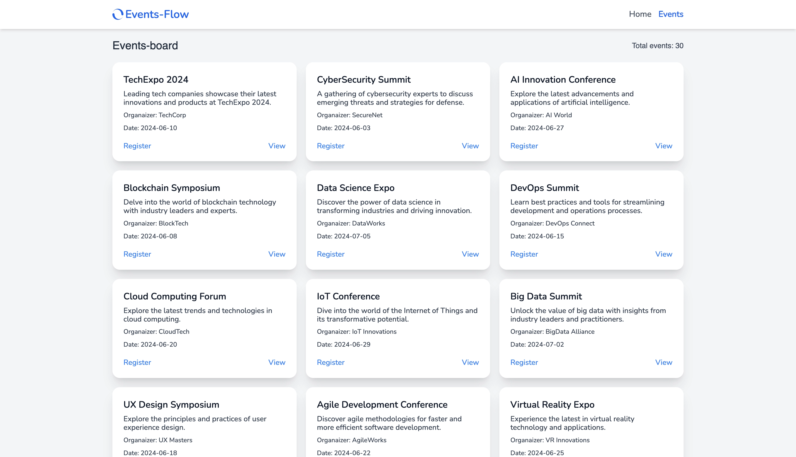
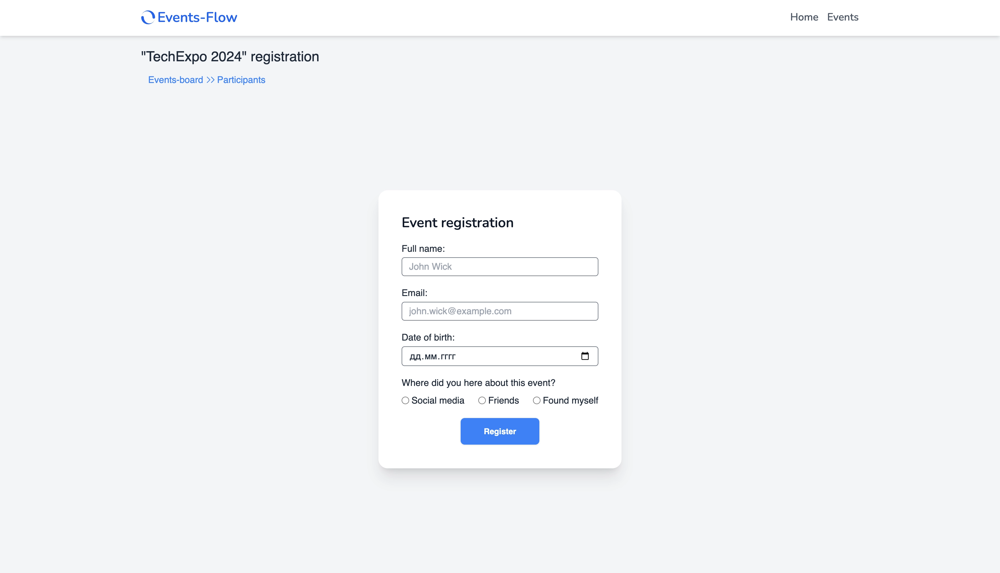
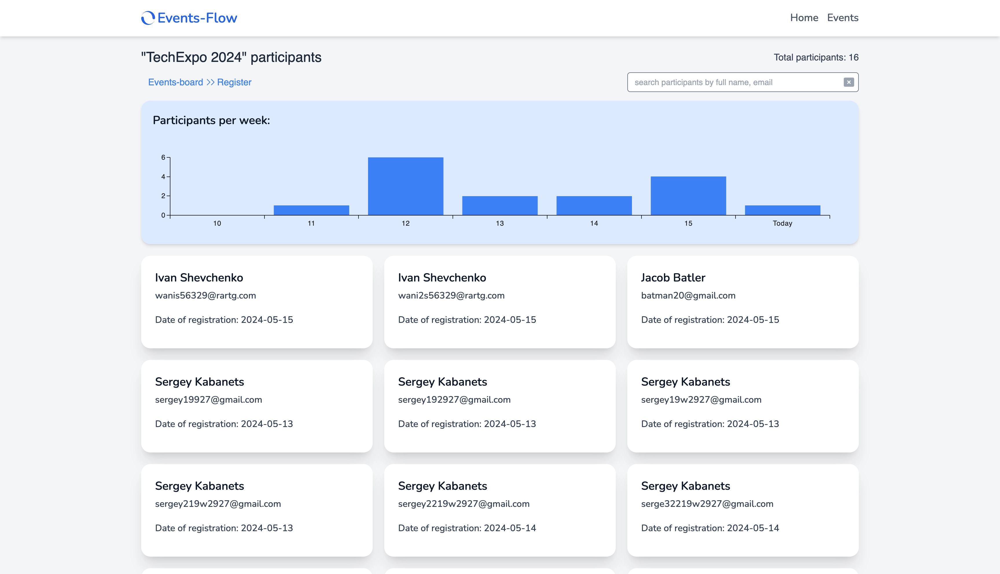

# Events-Feed - application for events registration

## Introduction

Welcome to the Events Registration App, where we believe in the power of connections and the
enrichment they bring to our lives. Our platform is designed to make event registration seamless and
enjoyable for both organizers and participants alike. Whether you're organizing a conference,
workshop, or social gathering, or simply looking to attend one, our user-friendly interface and
innovative features ensure that every event is a success.

## Features

**Events-board page**:

- Displays a paginated list of available events.
- Each event includes details such as title, description, event date, and organizer.
- Implements infinite scroll pagination for seamless browsing.

**Registration page**:

- Provides a user-friendly form for event registration.
- Form validation ensures accurate and complete user input.

**Participants page**:

- Allows users to view a list of registered participants for each event.
- Enables search by full name or email for easy navigation.
- Presents bar charts showing registrations per last week, offering insights into event popularity
  trends.

## Technologies Used:

## Demo

This project is deployed on Vercel. Check it out: [**Events-Feed**](events-flow.vercel.app)
